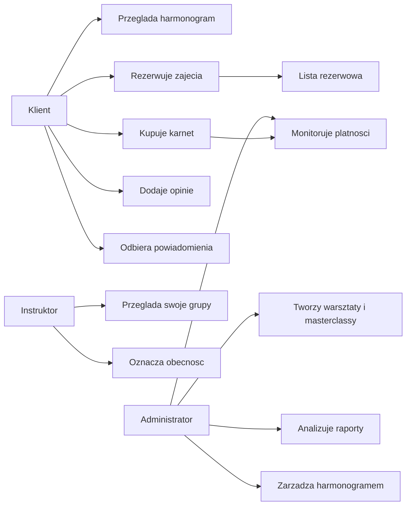
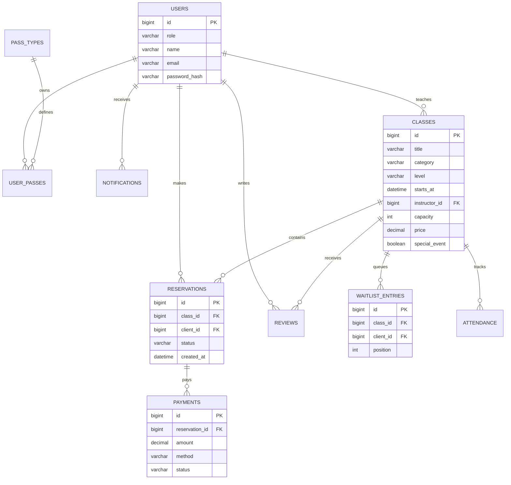
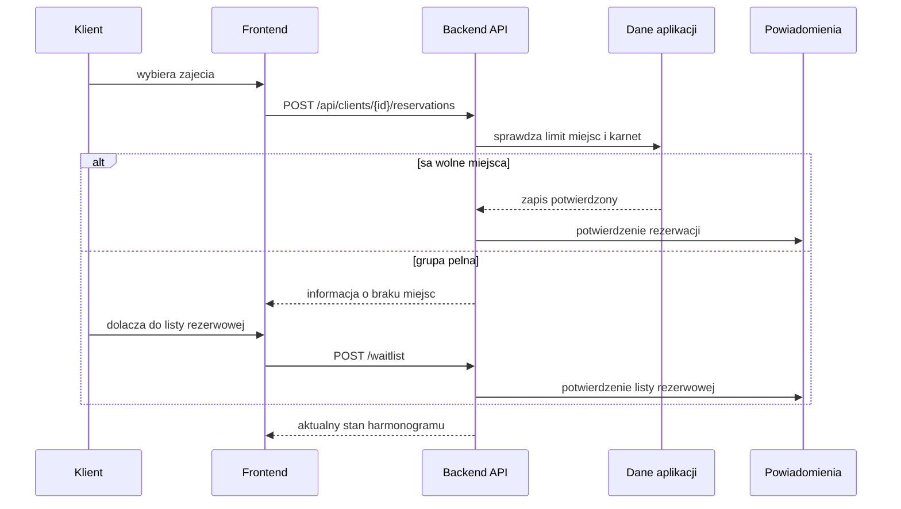

# Diagramy projektu

## Diagram przypadkow uzycia

```mermaid
flowchart LR
  Client["Klient"] --> Browse["Przeglada harmonogram"]
  Client --> Reserve["Rezerwuje zajecia"]
  Client --> BuyPass["Kupuje karnet"]
  Client --> Review["Dodaje opinie"]
  Client --> Notifications["Odbiera powiadomienia"]

  Trainer["Instruktor"] --> Groups["Przeglada swoje grupy"]
  Trainer --> Attendance["Oznacza obecnosc"]

  Admin["Administrator"] --> Events["Tworzy warsztaty i masterclassy"]
  Admin --> Reports["Analizuje raporty"]
  Admin --> Payments["Monitoruje platnosci"]
  Admin --> Schedule["Zarzadza harmonogramem"]

  Reserve --> Waitlist["Lista rezerwowa"]
  BuyPass --> Payments
```

## ERD bazy danych

```mermaid
erDiagram
  USERS ||--o{ USER_PASSES : owns
  PASS_TYPES ||--o{ USER_PASSES : defines
  USERS ||--o{ RESERVATIONS : makes
  USERS ||--o{ REVIEWS : writes
  USERS ||--o{ NOTIFICATIONS : receives
  USERS ||--o{ CLASSES : teaches
  CLASSES ||--o{ RESERVATIONS : contains
  CLASSES ||--o{ WAITLIST_ENTRIES : queues
  CLASSES ||--o{ REVIEWS : receives
  CLASSES ||--o{ ATTENDANCE : tracks
  RESERVATIONS ||--o{ PAYMENTS : pays

  USERS {
    bigint id PK
    varchar role
    varchar name
    varchar email
    varchar password_hash
  }
  CLASSES {
    bigint id PK
    varchar title
    varchar category
    varchar level
    datetime starts_at
    bigint instructor_id FK
    int capacity
    decimal price
    boolean special_event
  }
  RESERVATIONS {
    bigint id PK
    bigint class_id FK
    bigint client_id FK
    varchar status
    datetime created_at
  }
  WAITLIST_ENTRIES {
    bigint id PK
    bigint class_id FK
    bigint client_id FK
    int position
  }
  PAYMENTS {
    bigint id PK
    bigint reservation_id FK
    decimal amount
    varchar method
    varchar status
  }
```

## Przeplyw rezerwacji

```mermaid
sequenceDiagram
  participant K as Klient
  participant UI as Frontend
  participant API as Backend API
  participant DB as Dane aplikacji
  participant N as Powiadomienia

  K->>UI: wybiera zajecia
  UI->>API: POST /api/clients/{id}/reservations
  API->>DB: sprawdza limit miejsc i karnet
  alt sa wolne miejsca
    DB-->>API: zapis potwierdzony
    API->>N: potwierdzenie rezerwacji
  else grupa pelna
    API-->>UI: informacja o braku miejsc
    K->>UI: dolacza do listy rezerwowej
    UI->>API: POST /waitlist
    API->>N: potwierdzenie listy rezerwowej
  end
  API-->>UI: aktualny stan harmonogramu
```

